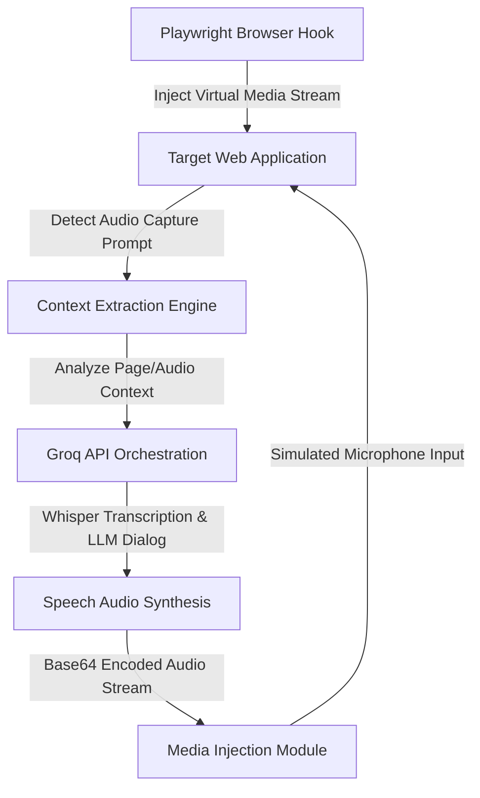

# Speech Media Automation Suite

A Python-based test automation framework designed to validate interactive voice interfaces. Built with **Playwright**, **Groq API**, and **gTTS**, it leverages a virtual media stream injection technique to stream synthesized speech responses directly into Chromium's audio capture interface.

This suite is cross-platform and fully compatible with **Windows**, **macOS**, and **Linux**.

---

## 🌟 Key Features

* **Virtual Media Stream Injection**: Intercepts and overrides Chromium's native media devices API at startup to route custom TTS audio data directly into the browser's media input stream.
* **Intelligent Dialog Automation**: Integrates the Groq API (`llama-3.1-8b-instant`) to analyze interface prompts, text context, or audio transcriptions and output context-aware voice responses.
* **Audio Transcription**: Utilizes Whisper (`whisper-large-v3`) to programmatically transcribe incoming audio files and oral prompts during execution.
* **Dynamic Dependency Resolver**: Automatically checks, installs, and validates missing pip libraries and browser binaries (Playwright Chromium) on execution.
* **Automated Flow Control**: Runs in the background, automatically scanning web layouts to respond to audio inputs without blocking user navigation.
* **Environment Configuration**: Excludes local setup metadata (`.env`, local session caching) using Git rules to safeguard environment configurations.

---

## 🛠️ System Architecture



---

## 🚀 Getting Started

### 1. Prerequisites
Ensure you have **Python 3.10 or higher** installed.

### 2. Execution
Download the project, navigate to the folder, and run:
```bash
python solver.py
```
*(On first run, the script will automatically set up the required dependencies and browser drivers).*

### 3. API Configuration
When prompted in the terminal, input your **Groq API Key** (obtainable from [console.groq.com](https://console.groq.com/)). The suite will automatically generate a local configuration `.env` file.

---

## 📖 Usage Workflow

1. Running `solver.py` starts a new automated Chromium instance.
2. Navigate to your target web application inside the browser.
3. Once loaded, return to the terminal and press **ENTER** once to initialize the background automation loop.
4. The suite will monitor the target interface, transcribing prompt cues and generating synthetic responses in real-time.

---

## 🔒 Security & Environment
All system keys, cache files, and persistent browser states (`user_data/`) are isolated and excluded via `.gitignore` to prevent credential exposure.
