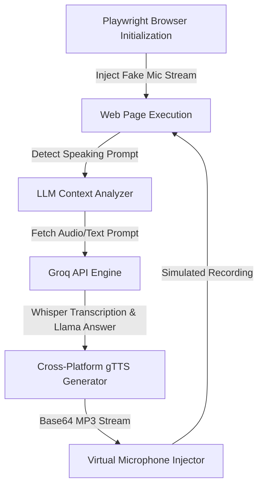

# Automated Speaking Assessment Solver

A powerful Python automation tool designed to solve speaking and listening assessments. Built with **Playwright**, **Groq API (Llama 3.1 & Whisper)**, and **gTTS**, it features a custom virtual media stream to inject synthesized speech audio directly into the browser's microphone input.

This script is fully cross-platform and compatible with **Windows**, **macOS**, and **Linux**.

---

## 🌟 Key Features

* **Virtual Microphone Audio Injection**: Modifies Chromium's native media devices API at startup to stream synthesized TTS responses directly into the browser's active recording interface.
* **LLM-Powered Decision Making**: Uses the Groq API (`llama-3.1-8b-instant`) to analyze text prompts, visual structures, or transcripts and output high-scoring business communication responses.
* **Audio Transcription**: Leverages Whisper (`whisper-large-v3`) to transcribe oral cues and listening-based prompts in real-time.
* **Zero-Setup Bootstrapping**: Dynamically resolves and installs missing pip dependencies and browser drivers (Playwright Chromium) on the very first run.
* **Automatic Background Detection**: Runs continuously in the background, automatically executing solver routines whenever the browser navigates onto active test pages.
* **Security & Environment Safety**: Configured with strict Git rules to prevent secret credentials (API Keys) or Chrome profiles from leaking into public repositories.

---

## 🛠️ Architecture Overview



---

## 🚀 Setup & Installation

### 1. Prerequisites
Ensure you have **Python 3.10 or higher** installed. 
* *Windows users: Make sure to check "Add Python to PATH" during installation.*

### 2. Run the Script
Clone this repository, navigate to the folder, and run:
```bash
python solver.py
```
*(On first execution, the script will automatically install all required packages and the Chromium driver).*

### 3. Configure API Key
When prompted in the terminal, paste your **Groq API Key** (available for free at [console.groq.com](https://console.groq.com/)). The script will automatically create a local `.env` file for you.

---

## 📖 How to Use

1. Launching `solver.py` will open a persistent Chrome browser window.
2. Log in to the test portal inside the browser window.
3. Once logged in, go back to the terminal and press **ENTER** once to start the background automation loop.
4. Browse to any lesson, module, or exam page. The solver will automatically detect speaking questions and process them in the background.
5. *Note: `ASSIST_MODE` is enabled by default, meaning you will manually review and click "Check" or "Continue" to submit answers.*

---

## 🔒 Security
Sensitive files such as `.env`, `user_data/` (Chrome session profiles), and `cache.json` are excluded via `.gitignore` to prevent credential exposure.
